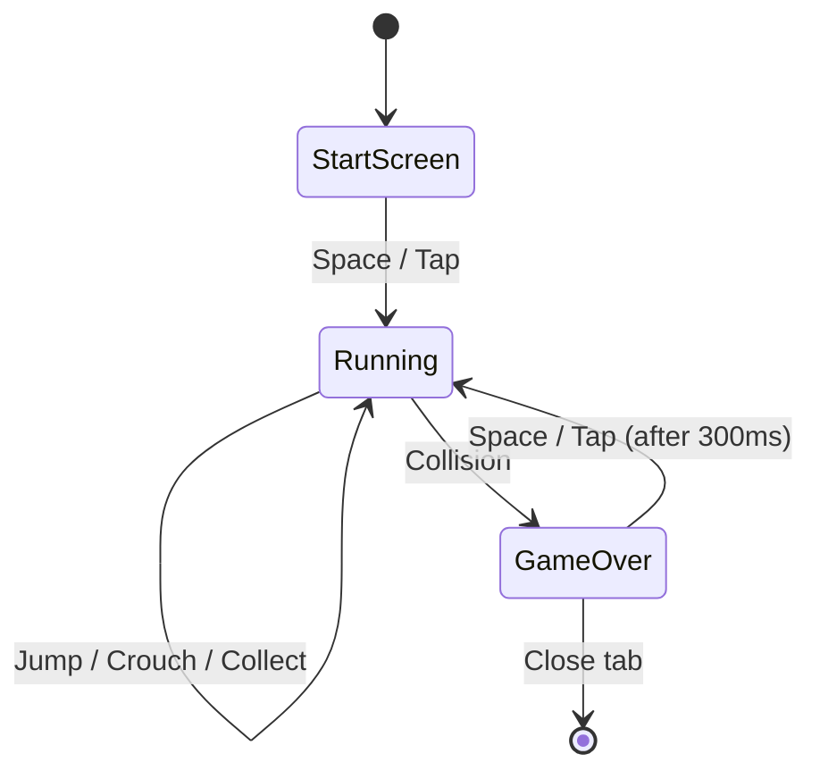

# Menemen Run — Product Specification

> **Document Version**: 1.1  
> **Date**: 2026-04-08  
> **Author**: Product Manager (AI-assisted)  
> **Status**: Approved — ready for implementation

---

## Executive Summary

### Elevator Pitch

A tiny browser game where a pixelated Turkish guy runs forever, dodging pans and chickens while collecting eggs, tomatoes, and peppers to make the perfect menemen.

### Problem Statement

Casual browser gamers (and Chrome Dino fans) lack a culturally playful, zero-install, instant-load alternative that works offline, on mobile, and on desktop — all in a single file with zero dependencies.

### Target Audience

| Segment | Description |
|---|---|
| **Casual gamers** | People who play Chrome Dino or Flappy Bird during downtime |
| **Turkish culture fans** | Anyone who appreciates Turkish food / humor |
| **Developers** | Devs browsing GitHub looking for fun, self-contained projects |
| **Offline users** | People on planes, trains, or bad Wi-Fi |

### Unique Selling Proposition

- **Single HTML file** — no build step, no dependencies, no assets
- **Culturally specific humor** — Turkish chef pixel-art + absurd "You forgot to eat" game-over
- **Dual scoring** — distance *and* ingredient collection
- **Instant load** (<1 s) and offline-capable

### Success Metrics

| Metric | Target |
|---|---|
| First Contentful Paint | < 500 ms |
| Total file size | < 30 KB |
| GitHub Stars (vanity) | 50+ in first month |
| Average session length | > 60 s |
| Mobile playability | Touch controls functional on iOS Safari + Android Chrome |

---

## User Personas

### Persona 1 — "Bored Commuter" (Primary)

- **Name**: Elif, 28, Istanbul
- **Context**: Riding the metro, phone in hand, spotty data
- **Goal**: Kill 5 minutes with something fun, no install
- **Frustration**: Games that need Wi-Fi, app stores, or loading screens
- **Quote**: *"I just want to tap my screen and play."*

### Persona 2 — "GitHub Explorer" (Secondary)

- **Name**: Mateo, 24, Berlin
- **Context**: Browsing GitHub trending repos
- **Goal**: Find a cool, self-contained project to fork or study
- **Frustration**: Repos with 200 MB of node_modules for a simple demo
- **Quote**: *"Wait — this whole game is one file?"*

---

## Feature Specifications

### F1 — Core Gameplay Loop

- **User Story**: As a player, I want the character to auto-run so I can focus on timing my jumps.
- **Acceptance Criteria**:
  - Given the game is running, the character moves right at a constant base speed
  - Given time progresses, speed increases gradually, soft-capping at 2x base speed
  - After 2x, speed continues to increase but at a much slower rate ("infinite" difficulty)
  - Given the character collides with an obstacle, the game ends immediately
- **Priority**: **P0** — without this, there is no game
- **Dependencies**: Canvas rendering loop, collision detection
- **Technical Constraints**: Must run at 60 FPS on mid-range phones
- **UX Considerations**: Speed ramp should feel gradual; post-2x increase is barely perceptible per tick but adds up

---

### F2 — Player Character (Pixel-Art Turkish Guy)

- **User Story**: As a player, I want a recognizable, charming character so the game has personality.
- **Acceptance Criteria**:
  - Character is drawn entirely via Canvas API (rectangles / arcs)
  - **Face**: Anonymous/Guy Fawkes-style mask — pale oval, arched eyebrows, upturned mustache, subtle grin
  - **Clothing**: Turkish-style vest or traditional attire (drawn as colored rectangles)
  - Character has visible legs for walk animation
  - Idle animation: legs cycle (2-frame walk)
  - Jump animation: legs tuck up
  - Crouch animation (desktop only): character height halves
- **Priority**: **P0**
- **Dependencies**: None
- **Technical Constraints**: All drawing in code, no external sprites
- **UX Considerations**: Must be visually distinct at small sizes (>= 32 px tall); mask face should be recognizable even at 24px width

---

### F3 — Jump Mechanic

- **User Story**: As a player, I want to press Space or tap to jump so I can avoid ground obstacles.
- **Acceptance Criteria**:
  - Space, ArrowUp, or screen tap triggers a jump
  - Jump follows a parabolic arc (gravity simulation)
  - Player cannot double-jump (single jump only while grounded)
  - Jump height clears the tallest ground obstacle with tight but fair margin
- **Priority**: **P0**
- **Dependencies**: F1 (game loop), F2 (character)
- **Technical Constraints**: Input latency < 1 frame (16 ms)
- **UX Considerations**: Jump should feel snappy — short rise time, slightly longer fall

---

### F4 — Crouch Mechanic (Desktop Only)

- **User Story**: As a player, I want to crouch so I can duck under aerial obstacles.
- **Acceptance Criteria**:
  - ArrowDown reduces character hitbox height by 50% (keyboard only)
  - Character returns to standing when key is released
  - **No crouch on mobile** — mobile uses tap-to-jump only
  - If aerial obstacles are implemented, crouch is the only way to avoid them
- **Priority**: **P2** — adds depth but not essential for MVP
- **Dependencies**: F2, aerial obstacle variant
- **Technical Constraints**: Hitbox must update instantly on key down/up

---

### F5 — Obstacles

- **User Story**: As a player, I want varied obstacles so gameplay stays interesting.
- **Acceptance Criteria**:
  - At least 3 obstacle types: **pan**, **crate**, **chicken**
  - Obstacles spawn at random intervals (min gap = character width x 3)
  - Obstacles scroll left at game speed
  - Each type has a distinct silhouette (drawn in code)
  - Collision uses axis-aligned bounding box (AABB) with a 2-4 px forgiveness margin
- **Priority**: **P0**
- **Dependencies**: F1
- **Technical Constraints**: No more than 5 obstacles on screen at once (performance)
- **UX Considerations**: Chicken should have a tiny 2-frame waddle animation for charm

---

### F6 — Collectibles (Ingredients) + Combo Bonus

- **User Story**: As a player, I want to collect eggs, tomatoes, and peppers to boost my score and unlock a scene change.
- **Acceptance Criteria**:
  - 3 collectible types: egg, tomato, pepper
  - Spawn at varying heights (ground level, low air, mid air)
  - Collection triggers a brief visual flash / particle burst
  - Each ingredient adds a fixed score bonus (egg: 10, tomato: 15, pepper: 20)
  - **Menemen Combo Bonus**: Collecting at least 1 of each type triggers a one-time combo bonus (+50 points) with a flash effect and "MENEMEN!" text
  - **Scene Transition**: After combo is achieved, the setting transitions from outdoor street to kitchen (see F12)
  - Ingredient count shown in HUD (with checkmarks for combo progress)
- **Priority**: **P0**
- **Dependencies**: F1, F3 (some collectibles require jumping)
- **Technical Constraints**: Drawn as simple colored shapes with pixel detail
- **UX Considerations**: Collectibles should be visually distinct from obstacles (warm food colors vs. grey/brown obstacles)

---

### F7 — Scoring System

- **User Story**: As a player, I want to see my score so I feel a sense of progress.
- **Acceptance Criteria**:
  - Score = distance points (1 per frame) + ingredient bonuses
  - Score displayed top-right, monospace font, always visible
  - High score persisted in localStorage
  - High score shown on game-over screen
- **Priority**: **P0**
- **Dependencies**: F1, F6
- **Technical Constraints**: localStorage may be unavailable in private browsing — graceful fallback (no crash)

---

### F8 — Start Screen

- **User Story**: As a player, I want a clear start screen so I know how to begin.
- **Acceptance Criteria**:
  - Title: **"Menemen Run"** in large pixel-style text
  - Subtitle: **"Press Space or Tap to Start"**
  - Character preview (static pose) centered
  - No auto-play; waits for input
- **Priority**: **P0**
- **Dependencies**: F2
- **UX Considerations**: Must be obvious on both desktop and mobile

---

### F9 — Game Over Screen

- **User Story**: As a player, I want a fun game-over screen so I'm motivated to retry.
- **Acceptance Criteria**:
  - Message: **"You forgot to eat. Try again."**
  - Final score + high score displayed
  - Ingredient tally shown (eggs / tomatoes / peppers collected)
  - Restart on Space / tap
  - Brief freeze (300 ms) before accepting restart input to prevent accidental restart
- **Priority**: **P0**
- **Dependencies**: F7, F5 (collision triggers game over)

---

### F12 — Scene Transition (Outdoor → Kitchen)

- **User Story**: As a player, I want the setting to change after I collect all ingredients so I feel a sense of progression.
- **Acceptance Criteria**:
  - Game starts in **outdoor street** setting (blue sky, grey sidewalk, simple buildings in background)
  - After **Menemen Combo** is achieved (1 egg + 1 tomato + 1 pepper collected), the scene transitions to a **kitchen** setting
  - Transition: quick horizontal wipe (~1 second) — background, ground color, and decorative elements change
  - **Kitchen**: warm interior colors, tiled floor, shelves/pots in background silhouette
  - Obstacles remain the same types but can have palette variants (e.g. shinier pan in kitchen)
  - Transition is one-way per run (no going back to street)
  - Gameplay is uninterrupted during transition (no pause)
- **Priority**: **P1** — core differentiator from other runners
- **Dependencies**: F6 (combo tracking)
- **Technical Constraints**: Background drawn as simple rectangles/gradients; transition is a lerp between two color palettes
- **UX Considerations**: Transition should feel rewarding — brief "MENEMEN!" flash before scene changes


---

### F11 — Jump Sound (Bonus)

- **User Story**: As a player, I want a tiny sound on jump for tactile feedback.
- **Acceptance Criteria**:
  - Generated via Web Audio API OscillatorNode (no audio files)
  - Short blip: 80 ms, sine wave, frequency sweep 400 to 600 Hz
  - Collect sound: different pitch (600 to 800 Hz)
  - Muted by default on mobile (browser autoplay policy)
- **Priority**: **P2** — adds polish, trivial with Web Audio API
- **Dependencies**: F3
- **Technical Constraints**: Must not block rendering; fire-and-forget

---

## Requirements

### Functional Requirements

#### User Flows



#### State Management

| State | Active Systems | Input Accepted |
|---|---|---|
| START | Render title, character preview | Space / Tap |
| RUNNING | Physics, spawning, collision, scoring, rendering | Space, ArrowUp, ArrowDown, Tap |
| GAME_OVER | Render overlay, persist high score | Space / Tap (after delay) |

#### Data Validation

- Score: integer >= 0, capped at 999999
- High score: validated on read from localStorage (NaN -> 0)
- Speed multiplier: clamped to [1.0, 2.0]

#### Integration Points

- None. Fully self-contained. No network calls.

---

### Non-Functional Requirements

| Requirement | Target |
|---|---|
| **Performance** | 60 FPS on 2020-era mid-range phone |
| **File size** | < 30 KB (single HTML file) |
| **Load time** | < 1 second on 3G |
| **Offline** | Fully functional with no network |
| **Browser support** | Chrome 80+, Firefox 78+, Safari 14+, Edge 80+ |
| **Mobile** | Touch input, responsive canvas scaling |
| **Accessibility** | High contrast colors, large touch targets |

---

### User Experience Requirements

#### Information Architecture

```
+----------------------------------+
|  [Score: 00000]    [HI: 00000]   |  <- HUD (top)
|                                  |
|                                  |
|     CHAR  ->  PAN  EGG  HEN     |  <- Game world (middle)
|  ================================|  <- Ground line
|  ################################|  <- Ground fill
+----------------------------------+
```

#### Progressive Disclosure

1. Start screen — only title + "Press Space"
2. Gameplay — score appears, obstacles + collectibles introduced gradually
3. Game over — full stats revealed

#### Error Prevention

- Ignore input during 300 ms post-death freeze
- Prevent double-jump
- Clamp speed to avoid unplayable velocities

#### Feedback Patterns

| Action | Feedback |
|---|---|
| Jump | Character rises + optional sound blip |
| Collect ingredient | Brief white flash + score increment |
| Collision | Screen shake (2 frames) + freeze + overlay |
| Speed increase | Subtle ground-scroll acceleration (no notification) |

---

## Technical Architecture

### Single-File Structure

```
index.html
  <style>        — minimal CSS (canvas centering, background)
  <canvas>       — game viewport
  <script>
    Constants   — colors, sizes, speeds, gravity
    State       — game state object
    Drawing     — character, obstacles, collectibles, HUD, screens
    Physics     — jump, gravity, collision (AABB)
    Spawning    — obstacle/collectible generation with randomness
    Input       — keyboard + touch event handlers
    Sound       — Web Audio API blips (optional)
    Game Loop   — requestAnimationFrame main loop
    Init        — canvas setup, state reset, event binding
```

### Key Technical Decisions

| Decision | Rationale |
|---|---|
| Canvas 2D (not WebGL) | Simpler, sufficient for pixel art, wider support |
| requestAnimationFrame | Battery-friendly, syncs with display refresh |
| AABB collision | Simple, fast, good enough for rectangular pixel art |
| HSL for day/night | Easy interpolation, readable code |
| No build tools | Single file, zero friction, GitHub Pages ready |
| localStorage for high score | Simplest persistence, no server needed |

### Canvas Sizing

- Base resolution: **800 x 300** (landscape)
- Scale to fit viewport width via CSS max-width: 100%
- Touch events mapped to canvas coordinates via getBoundingClientRect()

---

## Prioritized Backlog

| # | Feature | Priority | Effort | Notes |
|---|---|---|---|---|
| 1 | Canvas setup + game loop | P0 | S | Foundation |
| 2 | Character drawing + walk animation | P0 | S | Core identity |
| 3 | Jump mechanic + gravity | P0 | S | Core gameplay |
| 4 | Ground + scrolling background | P0 | S | World context |
| 5 | Obstacle spawning + rendering | P0 | M | 3 types |
| 6 | Collision detection | P0 | S | Game-over trigger |
| 7 | Collectible spawning + rendering | P0 | M | 3 ingredient types |
| 8 | Scoring system + HUD | P0 | S | Feedback loop |
| 9 | Start screen | P0 | S | Entry point |
| 10 | Game over screen | P0 | S | Retry loop |
| 11 | Speed progression | P0 | S | Difficulty curve |
| 12 | High score persistence | P0 | S | Retention hook |
| 13 | Mobile touch controls | P0 | S | Audience reach |
| 14 | Day/night cycle | P2 | S | Visual polish |
| 15 | Sound effects (Web Audio) | P2 | S | Tactile polish |
| 16 | Crouch mechanic | P2 | S | Depth (if time) |

> **S** = Small (< 30 min), **M** = Medium (30-60 min)

---

## Critical Questions Checklist

- [x] Are there existing solutions we're improving upon? — Yes: Chrome Dino, Edge Surf. We add cultural flavor + dual scoring.
- [x] What's the minimum viable version? — Auto-run, jump, 1 obstacle type, distance score, start/game-over screens.
- [x] What are the potential risks? — Mobile touch responsiveness; Canvas performance on low-end devices.
- [x] Have we considered platform-specific requirements? — iOS Safari audio autoplay policy handled (muted by default).
- [x] What GAPS exist? — None blocking. All requirements are self-contained.

---

## Stakeholder Decisions (Resolved)

1. ✅ **Character**: Anonymous/Guy Fawkes-style mask face with mustache + Turkish clothing
2. ✅ **Speed**: Soft cap at 2×, then continues increasing slowly (infinite difficulty)
3. ✅ **Mobile**: Tap-to-jump only, no crouch on mobile
4. ✅ **Scoring**: Individual ingredient scores + Menemen Combo bonus (+50) for collecting all 3 types
5. ✅ **Scene**: Outdoor street → kitchen transition after combo is achieved

---

## Verification Plan

### Automated Tests

Since this is a single-file Canvas game, traditional unit tests are impractical. Verification will be:

1. **Browser test via browser tool**: Open index.html, verify start screen renders, simulate Space press, confirm game loop starts
2. **File size check**: Must be < 30 KB
3. **HTML validation**: No errors

### Manual Verification

1. **Desktop**: Play in Chrome, Firefox, Edge — verify 60 FPS, all 3 obstacle types, all 3 collectibles
2. **Mobile**: Open on phone browser — verify touch jump, canvas scaling, no horizontal scroll
3. **Offline**: Disconnect Wi-Fi, reload page — game must work
4. **Game flow**: Start -> play -> die -> see score -> restart — full cycle without errors
5. **High score**: Play twice, verify high score persists across page reloads
6. **Performance**: Open DevTools Performance tab, confirm no frame drops on 2-minute session
